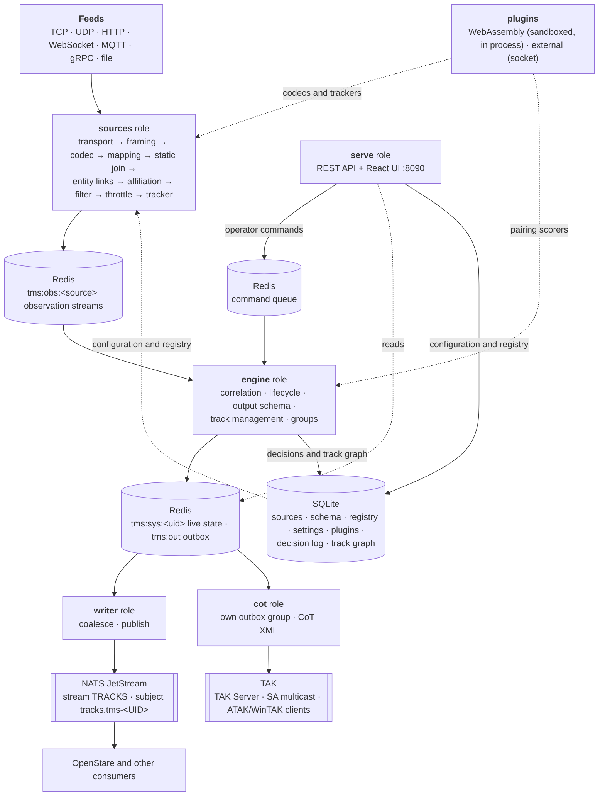

# OpenTrack

OpenTrack is a source-agnostic **track management server**. It ingests any number of feeds (AIS,
ADS-B, TAK/CoT, GPS, radar and lidar plots, STANAG 4607 GMTI...), turns raw detections into tracks
with a **tracker**, fuses every source's tracks into one set of system tracks with a **track
correlator**, lets a track manager curate that picture (**track management**: designate, pair, merge,
group and delete tracks), and publishes it to NATS JetStream in an OTH-GOLD-style message for
OpenStare and any other consumer.

Version **0.3.1 (alpha)**: interfaces, the published message (`opentrack.track.v2`), the plugin
interface (`opentrack:plugin@0.1.0`) and the database schema may still change. Back up
`data/opentrack.db` before upgrading; migrations run on start. What changed: [CHANGELOG.md](CHANGELOG.md).

Design and roadmap: [Track Management Server — Design & Roadmap](https://claude.ai/code/artifact/3876ba1a-0e0f-49fd-9f70-47e1c2bb8e7d).

## Guides

- [Administrator guide](docs/guides/admin.md): installing, configuring, accounts and sign-in, backup,
  upgrades, monitoring and troubleshooting.
- [Operator guide](docs/guides/operator.md): the picture day to day, for track managers and viewers.

Both are also in the UI, under **Help**, and work offline.

## What it does

**Tracker.** A source that reports anonymous plots (radar, lidar, GMTI) can run a tracker stage in
its pipeline: GNN (global nearest neighbour) or MHT (multiple hypothesis tracking, fewer false
tracks in clutter). Each track carries its **existence** probability, from how well its plots fit
against clutter and how often it goes unseen, which confirms and drops it; its reports carry the
position error ellipse and the full position and velocity covariance. For GMTI the tracker times
itself by the revisit rate it measures in the stream. A tracker's tracks carry no identity: unknown
affiliation and at most a domain. **Tracker profiles** (`profiles/trackers/`) hold a sensor's
tracker settings as a JSON file: wide-area and heavy-clutter GMTI, Global Hawk, Lynx, ASTOR and LSRS
class MTI, marine, coastal and air surveillance radars, and lidar. A source's tracker stage loads
one; a tuned tracker is saved, imported or downloaded as one.

**Track correlation.** The engine keeps every source's own tracks (source tracks) and pairs them
into **system tracks**, GOLD style: tracks sharing an identifier pair at once; otherwise tracks are
compared kinematically with their covariance propagated in time (a stopped target as a slow drift),
scored as likelihood ratios against another object being there, and paired when the probability of
the same object reaches 0.99. A slow feed's last report is reused against a sensor's newer ones at
reduced weight, so a radar track joins its AIS or ADS-B track within its life. It
proposes a split when a source stops agreeing with its track, keeps operators' do-not-pair rules, and
in suggest mode queues pairings for an operator instead. Each system track shows the best source's
view (position from the most precise recent report, identity from the most trusted source) and a
confidence built from its sources' existence and pairing confidences. Every decision is recorded
with its evidence in a temporal **track graph**, so any track can explain how it came to be.
Algorithms and scores: [docs/algorithms.md](docs/algorithms.md).

**Track management.** A track manager works on the picture from the Track Management tab, as
OTH-GOLD's track management sets do:

* **Designate**: edit a track's entity from its card (name, class, domain, affiliation, symbol,
  attributes; publish always or never). A track no identifier names (radar, GMTI) gets an entity
  pinned to it, so "mark this radar track hostile" is Edit, affiliation `hostile`, Save.
* **Pair** (PAIR): the same object, kept as separate tracks; each lists the others.
* **Merge** (MRG): one track survives with the others' history, sources, groups and pairings, and
  correlation never splits it again.
* **Group**: a carrier battle group, a flight of bombers, a convoy, published as a track of its own
  at the centre of its live members, with a 2525C symbol built from a naval task organisation or the
  members' shared function, the task-force indicator and an echelon.
* **Delete** (DEL): the track is deleted downstream (a group is dissolved; its members stay).

**Plugins.** Codecs, trackers and pairing scorers of your own, beside the built-in ones. They are
WebAssembly components run sandboxed inside OpenTrack, with only the memory, time, files and
network an operator grants them. Or they are external programs serving the same interface over a
socket, for Python with numpy or Stone Soup, or a GPU. They are managed in Settings → General → Plugins and
written with the Rust and Python SDKs in `sdk/`. A scorer's evidence feeds the engine's own pairing
test, so every decision stays explainable. See [docs/plugins.md](docs/plugins.md).

**Outputs: NATS and TAK.** Every published track goes to NATS as JSON (`opentrack.track.v2`, one
subject per track, for OpenStare and other consumers) and, when an admin configures it, to TAK as
Cursor-on-Target: to a TAK Server's streaming input (TCP or TLS with a client certificate), as UDP
SA multicast, or to ATAK/WinTAK clients connecting to OpenTrack (TCP or TLS, with optional client
certificates), each getting the live picture on connect. The `cot` role reads the outbox in its own
consumer group, so a slow TAK link never holds up NATS. See the admin guide,
[TAK output](docs/guides/admin.md#tak-output).

**Entities.** One registry of real-world objects: identifiers of any scheme (`mmsi`, `icao`,
`elnot`...), a status, the OTH-GOLD minimum (name, class name, domain, affiliation, track type, CoT
type, SIDC) and typed free-form attributes. Each source's pipeline links entity fields and track
fields at a trusted match, one way per link: **entity → track** (the entity is the authority; its
value replaces the feed's and the track shows the difference) or **track → entity** (the feed updates
the entity, e.g. an AIS destination). Saving an entity updates its live tracks at once.

## Architecture



* **Roles.** `opentrack all` runs every role in one process; `serve`, `sources`, `engine`,
  `writer` and `cot` run them separately (each is stateless beyond SQLite and Redis). The engine owns live
  track state; the API sends it commands and waits for its answer, so it works in or out of process.
* **Storage.** **SQLite** holds everything a person decided or configured (sources and their
  revisions, the output schema, the entity registry and its revisions, correlation settings, the
  decision log and the temporal track graph). **Redis** holds everything feeds produce: observation
  streams, live source and system track state, the outbox and metrics.
* **Output.** One NATS subject per track, `tracks.tms-<UID>`, where the UID is a GOLD-style
  3-character site code plus a 9-digit sequence. The `TRACKS` stream keeps the latest message per
  track, so a late consumer gets the whole picture. Updates are coalesced per track (at most every
  5 s, at once for significant changes).
* **Rust workspace + React UI.** The server is Rust (tokio, axum, rusqlite, redis, async-nats); the
  UI is React + TypeScript on OpenStare's stareSDK components.

## Layout

```
crates/
  ot-core     authoritative schema (Observation), system tracks, GOLD UIDs, OTH-GOLD minimum, SIDC, the published message
  ot-store    SQLite (decisions, config, registry, groups, temporal track graph) and Redis (streams, live state, outbox)
  ot-nats     NATS JetStream publisher (stream setup, acknowledged publishes, status)
  ot-source   source framework: transports, framing, codecs, the plugin registry, mapping, entity stage, filter, tracker (GNN/MHT), throttle
  ot-plugin   plugin hosts: WebAssembly components (wasmtime, grants) and external plugins over a socket
  ot-codec-stanag4607  STANAG 4607 (Edition 3) GMTI decoder: every segment type, typed and as JSON records
  ot-sapient  SAPIENT (BSI Flex 335 v2.0) decoder: SapientMessage protobuf to JSON records
  ot-server   the `opentrack` binary: serve | sources | engine | writer | cot | all | migrate | synthetic | bench | plugin | retire
docs/
  nats-output.md   the published track contract, for consumers
  algorithms.md    tracker and correlation algorithms, versions and scores
  plugins.md       the plugin interface, grants, SDKs and the external protocol
  examples/        aisstream, adsb.lol, STANAG 4607 GMTI, a GPS feed and the Autoferry demo as pure configuration
scripts/benchmark/   the tracker and correlation benchmark (bench.py: scenarios, scoring), and
             replay/ tools that feed a running OpenTrack: gmti-rebroadcast.py (4607 recordings over TCP),
             gmti-gps-replay.py (GMTI and GPS logs of one exercise on one clock), autoferry-replay.py
sdk/         plugin SDKs: rust/ (WebAssembly components) and python/ (external plugins or components), with examples
wit/         the plugin interface (plugin.wit)
profiles/    tracker profiles shipped with OpenTrack (profiles/trackers/*.json)
ui/          React + TypeScript (Vite) on stareSDK
```

The UI's tabs:

* **Overview**: system status and metrics.
* **Sources**: topology of every pipeline, the source list, the add-source wizard, and the pipeline
  designer with a live preview of each stage.
* **Correlation**: the engine's suggestions to accept or reject, correlation settings (applied while
  running) and every decision with its evidence.
* **Track Management**: map, track card (GOLD fields, attributes, provenance, **Edit**) and the
  tracks table with pair, merge, group and delete.
* **Registry**: entities (identifiers, minimum, attributes, publish override, history), spreadsheet
  export and import.
* **Schema**: the output schema's versions (drafted, then published).
* **Settings**: site name, classification banner, plugins (add, enable, grant, check, delete), data
  export, purge.
* **Help**: the administrator and operator guides.

## Sources and pipelines

A source is a transport (`tcp_client`, `tcp_server`, `udp` with multicast, `http_poll`, `websocket`,
`mqtt`, `grpc_client`, `grpc_server`, `file`, which reads only under the data directory), framing, a codec and a pipeline. Transport metadata reaches the mapping under
`_frame` (an MQTT topic is `_frame.topic`, `_frame.topic_levels[1]` its second level). Secrets are
written as `${env:NAME}` and resolved when the source starts.

`tcp_client`, `http_poll` (`https://`), `websocket` (`wss://`) and `mqtt` (`mqtts://`) take a
`tls` object: `ca_file` (trusted instead of the system roots), `cert_file` and `key_file` (a client
certificate for mutual TLS), `server_name` (verify against this name instead of the host) and
`insecure_skip_verify` (development only). `tcp_server` takes `tls: {cert_file, key_file,
client_ca_file}`; with a client CA, only clients presenting a certificate it signed are accepted,
and each client's certificate subject is logged. Files are PEM; paths may use `${env:NAME}`.

A source reports either **tracks** (a key per object: AIS, ADS-B, TAK, a radar's own tracks) or
**detections** (`"reports": "detections"`: anonymous plots). Detections update the nearest system
track another source keeps or, with a tracker stage, become tracks first. A mapping rule of kind
`static` caches identity fields (AIS static data) that the static join fills into later reports; a
rule of kind `track` bypasses the tracker. A mapping can send a value straight to the matched entity
with an `entity.<key>` destination.

**Protobuf over gRPC.** Upload the producer's `.proto` files with the source (the `protobuf`
codec). They are compiled when the source runs, with no `protoc` and no rebuild. Then either:
- OpenTrack calls the producer's streaming method (`grpc_client`), or
- producers call OpenTrack (`grpc_server`), with a bearer token, mutual TLS, size and connection
  limits, and every message checked against the schema.

Protobuf also works over the other transports. See [docs/protobuf-grpc.md](docs/protobuf-grpc.md)
and the example producer in `docs/examples/grpc/`.

**Non-point contacts.** Lines of bearing (ESM, direction finding) and areas of uncertainty (ELINT)
map to an observation's `geometry`. A bearing goes to the track its emitter belongs to; bearings
from several sensors are cross-fixed into positions that start or update tracks, with ghosts kept
out. See [docs/non-point-contacts.md](docs/non-point-contacts.md).

**Codec plugins** decode formats beyond JSON and XML (`"codec": {"type": "plugin", "plugin":
"stanag4607", "options": {...}}`), and **tracker plugins** run as a tracker stage (see Plugins
below). **STANAG 4607** GMTI streams over TCP; [docs/examples/stanag4607.json](docs/examples/stanag4607.json)
turns every dwell target into a detection with a ground error ellipse from the radar geometry, forms
ground tracks with the GNN tracker timed by the measured revisit rate, and publishes the sensor
platform itself as a friendly track. **SAPIENT** (BSI Flex 335 v2.0) is the built-in `sapient` codec
plugin: each `SapientMessage` (over TCP with a 4-byte little-endian length prefix, or one per MQTT
message) becomes a JSON record for the mapping; [docs/examples/sapient.json](docs/examples/sapient.json)
maps detection reports.

Per source, the publish stage sets:

* **Publish alone**: whether a track only this source reports for is published (default: yes for
  track feeds, no for detections, whose tracks wait for a track feed to report for them too).
* **Confirm after**: reports a new track needs before it is confirmed (default: 1 for track feeds,
  whose track is already a track; the engine's default, 3, for detections). A track needs the
  fewest any of its sources asks for.
* **Security label**: classification, restrictions and sharing in the shape OpenStare's ICD
  reserves under `security.*`, carried by everything the source reports into the published message.

## What is published

Only authoritative tracks are published: confirmed, and reported for by a source that may stand
alone, unless an entity overrides it (**always** publishes at once; **never** keeps the track
inside OpenTrack). An **output filter** (Correlation settings) can hold tracks back by area,
affiliation, domain, track type, minimum confidence or a rule; a published track that stops passing
is deleted downstream until it passes again. A system track no source reports for any more is
retired and deleted downstream.

A track message (`opentrack.track.v2`, `upsert` or `delete`) carries:

* **The OTH-GOLD minimum**, always: track number, class-name (in capitals), force code, track type,
  time and position (the mandatory CTC and POS fields of OS-OTG Rev C), plus a symbol code (`sidc`:
  MIL-STD-2525C, 2525D or a CoT type, with its standard named).
* **`attributes`**, the admin's output schema (Schema tab): each field is filled by a feed mapping,
  an entity attribute a pipeline links to it, or an OpenTrack built-in (state, speed, confidence,
  identifiers, sources...).
* **Track management**: `kind: group`, a group's `members`, a track's `groups` and `paired_with`,
  and the `security` label when present.

Full contract: [docs/nats-output.md](docs/nats-output.md).

The same tracks go to TAK as CoT events (`uid` `tms-<UID>`, `type` from the SIDC or affiliation
and domain, `how` `m-f`, position error as `ce`/`le`, course, speed and callsign), refreshed before
they go stale, and a `t-x-d-d` delete when they end: [TAK output](docs/guides/admin.md#tak-output).

## Sign-in and roles

Every API call needs a signed-in caller, modelled on OpenStare's sign-in.

| Role | What it may do |
|---|---|
| `viewer` | See everything except accounts and secrets |
| `track_manager` | Also pair, merge, split, delete, group and designate tracks, undo those, and delete history points |
| `admin` | Also configure OpenTrack: sources, settings, plugins, accounts and sign-in |

- **How a caller signs in:**
  - **A password:** local accounts, PBKDF2-HMAC-SHA256 in the FIPS module (docs/security/fips.md), with a signed `ot_session` cookie. Sessions last 24 h at most.
  - **SAML single sign-on**, as OpenStare's: paste the identity provider's metadata in Settings → Security → Single sign-on, map its role attribute to roles, and set `OT_PUBLIC_URL`.
  - **OpenStare's own sign-in**, when OpenTrack runs beside OpenStare: a browser signed in to OpenStare on the same host, or an OpenStare API token, is let in with a mapped role.
  - **An API token**, for machines: made in Settings → Users or with `opentrack user token`, sent as `Authorization: Bearer`.
  - **A client certificate** over TLS, mapped to an account in Settings → Security.
- **The first account** is an admin, from `OT_ADMIN_EMAIL` and `OT_ADMIN_PASSWORD`. Without them, it is `admin@opentrack.local`, with a made-up password in `initial-admin.txt` beside the database.
- **Every change** names the account that made it in the decision log.
- **Account policy** (fixed at the DoD application security STIG values, 800-53 Moderate; not configurable):
  - **Passwords** (local accounts): 15 characters with upper, lower, digit and special; not one of the last 5, nor a common password; 8 characters changed; at most one change a day; 60 days, then changed at the next sign-in. A password an admin sets is temporary: the account must choose its own before anything else. Existing passwords keep working until they change or expire (60 days from the upgrade).
  - **Lockout:** 3 failed sign-ins within 15 minutes lock the account until an admin unlocks it (Settings → Users, or `opentrack user unlock` on the server). Every refusal says the same thing.
  - **Sessions** are kept on the server: 15 minutes idle ends one (10 for admins; the page's own refreshes do not count), as do 24 hours from sign-in; at most 3 per account, the oldest ends. Anyone sees and ends their own (account menu → Sessions); admins sign an account out everywhere (Settings → Users). API tokens are not sessions: they only expire. Sessions are per node.
  - **Inactivity:** accounts not signed in for 35 days are turned off; an admin turns them on again. Break-glass accounts are exempt (Settings → Users → Never turn off).
  - After signing in, a notice gives the previous sign-in and the failed attempts since.
- **Audit record:** every decision and every sign-in event (success and failure with reason and address, sign-out, lockout, unlock, session time-out and end, password change and expiry, accounts turned off, settings changes) in an append-only table, each row SHA-256 chained to the one before. Every row is also written to the server log (`audit record`, target `audit`) and exported over OpenTelemetry as a log event named `audit.record`, for a SIEM; `GET /api/v1/audit` filters it and exports CSV and `/api/v1/audit/verify` checks the chain (admins). A sign-in whose record cannot be written is refused. It is kept forever.
- **Web hardening:** a content security policy, `nosniff`, no framing, no referrer, HSTS over TLS and `no-store` on the API, on every response. The session cookie is `HttpOnly`, `SameSite=Strict`, and `Secure` over TLS or behind a TLS proxy (`OT_PUBLIC_TLS=1`).
- **Security labels:** a fused track or group is marked with the highest classification of its sources (the order is a correlation setting, Settings → Security → Security labels), the union of their restrictions and the intersection of their releasability.
- **Settings → Banners** can require users to accept a warning after signing in (as OpenStare's warning banner), besides the classification banner.
- **`OT_AUTH=off`** turns sign-in off for development: every caller is an admin. The server warns every minute and the UI shows a red banner.

## Track management: undo and history

- **Undo.** A track manager can undo a pair, unpair, delete, merge, split, "do not pair" or group change from the decision log. The undo is itself a decision.
  - A deleted or merged-away track comes back under its UID.
  - An undo is refused while a later change by someone else to the same tracks stands.
- **Position history.** Each system track's published positions are kept for 12 h by default, at most one point every 10 s (Settings: `history_hours`, `history_interval_secs`).
  - A point costs about 130 bytes of Redis: 2,000 tracks for 12 h at 10 s is about 1.1 GB.
- **Delete history point.** A track manager can delete a bad point.
  - The deletion goes out on NATS ([docs/nats-output.md](docs/nats-output.md)).
  - When it was the track's latest point, the track steps back to the point before.

## API

Everything the UI does is a REST call under `/api/v1`. The main ones:

| | |
|---|---|
| Sign-in | `POST /auth/login`, `/auth/logout`, `GET /auth/me`, `/auth/public`, `POST /auth/password`; SAML at `/auth/saml/login`, `/auth/saml/acs`, `/auth/saml/metadata` |
| Accounts | `GET/POST /auth/users`, `PUT/DELETE /auth/users/{id}`, `POST /auth/users/{id}/password`, `/auth/users/{id}/revoke`, `GET/POST /auth/api-tokens`, `DELETE /auth/api-tokens/{jti}`, `GET/PUT /auth/settings` |
| Decisions | `GET /decisions?op=…`, `POST /decisions/{id}/undo` |
| History | `GET /tracks/{uid}/history`, `POST /history/{uid}/delete` |
| Sources | `GET/POST /sources`, `GET/PUT/DELETE /sources/{id}`, `POST /sources/{id}/enable`, `/sources/{id}/disable`, `/sources/validate`, `/probe`, `GET /sources/{id}/revisions`, `/sources/{id}/metrics` |
| Plugins | `GET/POST /plugins`, `GET/PUT/DELETE /plugins/{name}`, `POST /plugins/{name}/check` |
| Tracker profiles | `GET/POST /tracker-profiles`, `GET/DELETE /tracker-profiles/{name}` |
| Status | `GET /status`, `/metrics`, `/healthz` |
| Tracks | `GET /tracks`, `GET /tracks/{uid}`, `GET /tracks/{uid}/explain` |
| Track management | `POST /tracks/pair`, `/tracks/unpair`, `/tracks/merge` (`hold` for a track manager's merge), `/tracks/delete`, `GET/POST /groups`, `PUT/DELETE /groups/{id}`, `POST /groups/{id}/members` |
| Correlation | `GET/PUT /correlation/settings`, `GET /correlation/suggestions`, `POST /correlation/suggestions/{id}/accept\|reject`, `POST /tracks/{uid}/split`, `/tracks/do-not-pair`, `GET /correlation/decisions` |
| Registry | `GET/POST /registry/entities`, `GET/PUT/DELETE /registry/entities/{id}`, `GET /registry/fields`, `GET /registry/export`, `POST /registry/import-sheet` |
| Schema | `GET /schema`, `PUT/DELETE /schema/draft`, `POST /schema/draft/publish` |
| Settings | `GET/PUT /settings`, `GET /public/banner`, `/public/warning-banner`, `GET /export/tracks`, `POST /admin/purge`, `GET /basemap/{z}/{x}/{y}` (map tiles, fetched from the tile server set) |
| Configuration backup | `GET /export/config` (the whole configuration, secrets included; admins), `GET/POST /import/config` (whether this node is empty; rebuild it from an export; admins) |

## Running

Requires Rust (stable), Node 22, Redis and a NATS server with JetStream enabled.

```sh
cargo build --release
(cd ui && npm ci && npm run build)

# every role in one process: control plane (API + UI on :8090), sources, engine, writer, cot
./target/release/opentrack all

# add a source through the API, then enable it
curl -X POST -H 'content-type: application/json' --data @docs/examples/aisstream.json localhost:8090/api/v1/sources
curl -X POST localhost:8090/api/v1/sources/aisstream/enable

# end-to-end check: push a synthetic track through, verify it in the stream, then retire it
./target/release/opentrack synthetic --verify --retire
```

Set `OT_NATS_STREAM=OPENTRACK_SELFTEST OT_NATS_TRACKS_SUBJECT=opentrack.selftest` (and a separate
`OT_REDIS_NAMESPACE`) on both `writer` and `synthetic` to exercise the pipeline without touching the
operational `tracks.>` subjects.

UI development: `opentrack serve` plus `cd ui && npm run dev` (Vite proxies `/api` to :8090).

Or with Docker: `docker compose up --build` (a bridge network with only 8090 published, its own
Redis, publishing to OpenStare's NATS on the host). For a local NATS with JetStream:
`docker compose --profile dev-nats up`, with `OT_NATS_URL=nats://nats:4222`. Nodes on the old
host-network file: see the administrator guide, "Upgrading a host-network deployment".

### Headless

OpenTrack needs no UI or operator to run. The UI is only a client of the REST API:
- **Without a built UI**, `serve` and `all` serve the API alone.
- **Configuration** goes through the API or files: source specs (as in `docs/examples/`), tracker
  profiles (JSON in `profiles/trackers/`), correlation settings, and plugins
  (`opentrack plugin add`). Every change goes in the decision log.
- **The roles run separately.** A node that only collects and correlates needs `sources` and
  `engine`, with `writer` to publish. It can start from a database prepared elsewhere
  (`OT_SQLITE_PATH`).
- **Accounts without the UI:** `opentrack user list|add|role|passwd|disable|enable|token`
  (passwords come from standard input). Machines sign in with an API token or a client
  certificate.
- **A lean build** without SAML (`cargo build --no-default-features`) needs no libxmlsec1. It
  still has accounts, API tokens, client certificates and OpenStare sign-in.
- **What a node needs:** the `opentrack` binary and Redis, plus NATS to publish.

This suits unattended or embedded nodes, such as a vehicle, a drone or a remote sensor site. Each
node gets its own `OT_SITE_CODE`, so track IDs from different nodes never clash.

### Several nodes, one picture

OpenTrack nodes (server sites, or a drone swarm) can share one track picture with no node in
charge ([design](docs/multi-node.md)):
- **One number per object.** The same object has the same track number on every node.
- **One reporter per track.** For each track, the node that sees it best reports it, as often as
  dead reckoning needs, and only from its own sensors.
- **Decisions hold everywhere.** A track manager's pair, merge, delete, group or undo on any node
  holds on every node, and so does a change to the output schema or the correlation settings.

OpenTrack does not do the networking. It hands its sync messages
([ICD](docs/sync-icd.md)) to whatever carries them, on its own NATS as `ot.sync.out.*` and
`ot.sync.in.*`. Nothing depends on that link delivering everything: nodes repair missed decisions
themselves.

Turning it on:
- Enable it in Settings → Nodes, and list the site codes of the trusted nodes.
- Between server sites, `opentrack bridge --node nats://a:4222 --node nats://b:4222` carries the
  messages. See `docs/examples/two-sites/`.
- `scripts/benchmark/bench swarm` measures how it copes with loss, a bandwidth cap and a
  partition.

### Configuration

| Variable | Default | |
|----------|---------|-|
| `OT_BIND` | `0.0.0.0:8090` | control plane address |
| `OT_SQLITE_PATH` | `data/opentrack.db` | created and migrated on start |
| `OT_REDIS_URL` | `redis://127.0.0.1:6379` | |
| `OT_REDIS_NAMESPACE` | `tms` | prefix for every Redis key |
| `OT_SITE_CODE` | `OTK` | GOLD site code for UIDs (3 characters, A–Z 0–9; fixed for a deployment) |
| `OT_NATS_URL` | `nats://127.0.0.1:4222` | NATS server(s), comma separated |
| `OT_NATS_CREDS` / `OT_NATS_TOKEN` / `OT_NATS_USER` + `OT_NATS_PASSWORD` | | NATS auth, if the server requires it |
| `OT_NATS_CA` | | TLS to NATS: trust this CA (PEM) and require TLS |
| `OT_NATS_CERT`, `OT_NATS_KEY` | | mutual TLS to NATS: this client certificate and key (PEM) |
| `OT_NATS_STREAM` | `TRACKS` | JetStream stream (created if missing, never modified) |
| `OT_NATS_TRACKS_SUBJECT` | `tracks` | subject prefix: tracks go to `<prefix>.tms-<UID>` |
| `OT_NATS_MAX_AGE_HOURS` | `24` | message age limit for a stream OpenTrack creates |
| `OT_WRITE_MIN_INTERVAL_SECS` | `5` | per-track write coalescing |
| `OT_CORRELATION` | `kinematics-metadata` | how tracks with no shared identifier pair until correlation settings are saved; saved settings win (a start with different ones saved logs a warning) |
| `OT_COT_CONSUMER` | `cot-1` | the `cot` role's consumer name on the outbox (run one per namespace) |
| `OT_COT_MIN_INTERVAL_SECS` | `2` | per-track TAK event coalescing; the outputs themselves are in Settings → TAK output |
| `OT_UI_DIR` | `ui/dist` | built UI served at `/` |
| `OT_AUTH` | `on` | `off` turns sign-in off (development only: every caller is an admin) |
| `OT_ADMIN_EMAIL`, `OT_ADMIN_PASSWORD` | | the first admin account, made when there are none |
| `OT_SESSION_SECRET` | made on first start | key session tokens are signed with (32+ characters); unset, `session.key` beside the database |
| `OT_PUBLIC_URL` | | where browsers reach OpenTrack (`https://host:8090`); SAML needs it |
| `OT_TLS_CERT`, `OT_TLS_KEY` | | serve the API and UI over TLS (cookies become `Secure`) |
| `OT_TLS_CLIENT_CA` | | with TLS, accept client certificates this CA signed, as the accounts Settings → Security maps them to |
| `OT_TLS_CLIENT_CRL` | | revocation lists for those client certificates (PEM/DER files or directories, comma separated); revoked, uncovered or stale-listed certificates are refused; reloaded on change |
| `OT_ADMIN_BIND` | | also listen here, and serve the admin routes only here (the main address answers them 404); for a management network |
| `OT_ADMIN_TLS_CERT`, `OT_ADMIN_TLS_KEY`, `OT_ADMIN_TLS_CLIENT_CA` | | the admin listener's own TLS; unset, the main listener's (the CRLs are shared) |
| `OT_REDIS_CA`, `OT_REDIS_CERT`, `OT_REDIS_KEY` | | TLS to Redis with a `rediss://` URL: trust this CA; mutual TLS with this certificate and key |
| `OT_PUBLIC_TLS` | off | `1`: a proxy in front ends TLS, so cookies are `Secure` and HSTS is sent (also implied by an `https://` `OT_PUBLIC_URL`) |
| `OT_SYNC_PREFIX` | `ot.sync` | subject prefix of the sync boundary with other nodes (`<prefix>.out.*`, `<prefix>.in.*`) |
| `OT_SYNC_SUMMARY_SECS` | `5` | seconds between the summaries that let nodes find missed decisions |
| `OT_LOG`, `OT_LOG_FORMAT` | `info`, text | `OT_LOG_FORMAT=json` for JSON logs |
| `OTEL_EXPORTER_OTLP_ENDPOINT`, `OTEL_*` | unset | Logs (audit included), traces and metrics over OpenTelemetry to your collector; the standard variables ([admin guide](docs/guides/admin.md#opentelemetry)) |

## Tests

```sh
cargo test                                              # unit tests
OT_TEST_REDIS_URL=redis://127.0.0.1:6379 \
OT_TEST_NATS_URL=nats://127.0.0.1:4222 \
OT_TEST_MQTT_URL=mqtt://127.0.0.1:1883 cargo test      # plus the Redis, NATS and MQTT tests
cd ui && npm run lint && npm run build
```

The Redis tests run in their own key namespace, the NATS tests in their own stream and the MQTT
tests on their own topics, and all clean up afterwards. The engine tests replay scripted reports
through a real engine (Redis and SQLite). The NATS tests need JetStream
(`docker run -p 4222:4222 nats:2 -js`); for MQTT any broker works
(`docker run -p 1883:1883 eclipse-mosquitto:2 mosquitto -c /mosquitto-no-auth.conf`).

## Benchmark

`scripts/benchmark/` scores the tracker and correlation against truth on recorded and simulated
scenarios: the Autoferry lidar and radar recordings, GMTI with the exercise GPS, Stone Soup's
Solent AIS and OpenSky ADS-B with simulated radars, and a synthetic crossing case. Each scenario
runs through `opentrack bench`, the real pipelines and engine on the scenario's clock (100 to 400
times real time), and is scored with GOSPA, SIAP-style track quality and identity measures, and
correlation precision and recall. The data is downloaded or read locally and never committed.

```sh
scripts/benchmark/setup.sh                 # a Python venv with numpy and scipy
scripts/benchmark/bench build all           # fetch the data, build the scenarios
scripts/benchmark/bench run all --label x   # run and score; compare two runs with `bench compare`
```

See [scripts/benchmark/README.md](scripts/benchmark/README.md).

## UI components

The UI uses only components from OpenStare's **stareSDK** (Elite Command Design System), vendored
as a packed build in `ui/vendor/` because the package is private and unpublished. Refresh it from a
local OpenStare checkout with `scripts/vendor-staresdk.sh`. Page layout uses stareSDK tokens
(`var(--…)`) only; new reusable components go upstream into stareSDK, not into this repo.
