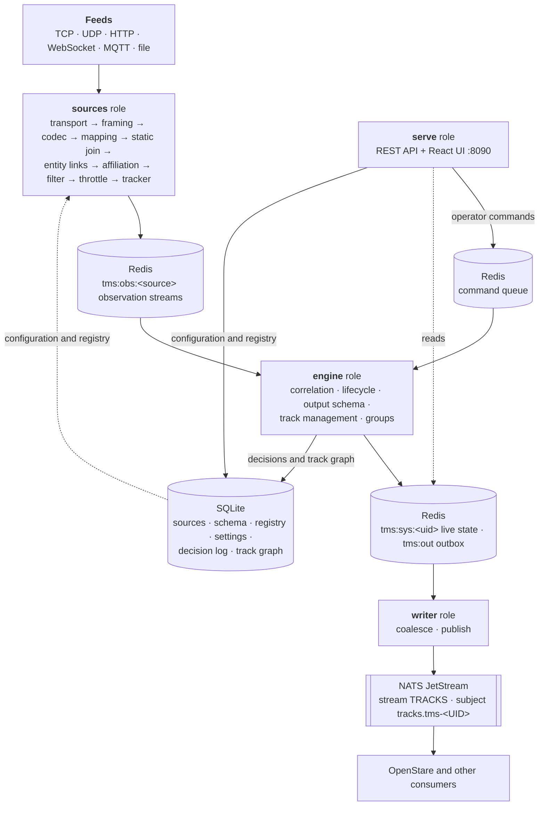

# OpenTrack

OpenTrack is a source-agnostic **track management server**. It ingests any number of feeds (AIS,
ADS-B, TAK/CoT, GPS, radar and lidar plots, STANAG 4607 GMTI...), turns raw detections into tracks
with a **tracker**, fuses every source's tracks into one set of system tracks with a **track
correlator**, lets a track manager curate that picture (**track management**: designate, pair, merge,
group and delete tracks), and publishes it to NATS JetStream in an OTH-GOLD-style message for
OpenStare and any other consumer.

Version **0.1.0 (alpha)**: interfaces, the published message (`opentrack.track.v2`) and the database
schema may still change. Back up `data/opentrack.db` before upgrading; migrations run on start.

Design and roadmap: [Track Management Server — Design & Roadmap](https://claude.ai/code/artifact/3876ba1a-0e0f-49fd-9f70-47e1c2bb8e7d).

## What it does

**Tracker.** A source that reports anonymous plots (radar, lidar, GMTI) can run a tracker stage in
its pipeline: GNN (global nearest neighbour) or MHT (multiple hypothesis tracking, fewer false
tracks in clutter). Each track carries its **existence** probability, from how well its plots fit
against clutter and how often it goes unseen, which confirms and drops it; its reports carry the
position error ellipse and the full position and velocity covariance. For GMTI the tracker times
itself by the revisit rate it measures in the stream. A tracker's tracks carry no identity: unknown
affiliation and at most a domain.

**Track correlation.** The engine keeps every source's own tracks (source tracks) and pairs them
into **system tracks**, GOLD style: tracks sharing an identifier pair at once; otherwise tracks are
compared kinematically with their covariance propagated in time, scored as likelihood ratios against
another object being there, and paired when the probability of the same object reaches 0.99. It
proposes a split when a source stops agreeing with its track, keeps operators' do-not-pair rules, and
in suggest mode queues pairings for an operator instead. Each system track shows the best source's
view (position from the most precise recent report, identity from the most trusted source) and a
confidence built from its sources' existence and pairing confidences. Every decision is recorded
with its evidence in a temporal **track graph**, so any track can explain how it came to be.
Algorithms and scores: [docs/algorithms.md](docs/algorithms.md).

**Track management.** A track manager works on the picture from the Track Management tab, as
OTH-GOLD's track management sets do:

* **Designate**: edit a track's entity from its card (name, class, domain, affiliation, symbol,
  attributes; publish always or never). A track no identifier names (radar, GMTI) gets an entity
  pinned to it, so "mark this radar track hostile" is Edit, affiliation `hostile`, Save.
* **Pair** (PAIR): the same object, kept as separate tracks; each lists the others.
* **Merge** (MRG): one track survives with the others' history, sources, groups and pairings, and
  correlation never splits it again.
* **Group**: a carrier battle group, a flight of bombers, a convoy, published as a track of its own
  at the centre of its live members, with a 2525C symbol built from a naval task organisation or the
  members' shared function, the task-force indicator and an echelon.
* **Delete** (DEL): the track is deleted downstream (a group is dissolved; its members stay).

**Entities.** One registry of real-world objects: identifiers of any scheme (`mmsi`, `icao`,
`elnot`...), a status, the OTH-GOLD minimum (name, class name, domain, affiliation, track type, CoT
type, SIDC) and typed free-form attributes. Each source's pipeline links entity fields and track
fields at a trusted match, one way per link: **entity → track** (the entity is the authority; its
value replaces the feed's and the track shows the difference) or **track → entity** (the feed updates
the entity, e.g. an AIS destination). Saving an entity updates its live tracks at once.

## Architecture



* **Roles.** `opentrack all` runs every role in one process; `serve`, `sources`, `engine` and
  `writer` run them separately (each is stateless beyond SQLite and Redis). The engine owns live
  track state; the API sends it commands and waits for its answer, so it works in or out of process.
* **Storage.** **SQLite** holds everything a person decided or configured (sources and their
  revisions, the output schema, the entity registry and its revisions, correlation settings, the
  decision log and the temporal track graph). **Redis** holds everything feeds produce: observation
  streams, live source and system track state, the outbox and metrics.
* **Output.** One NATS subject per track, `tracks.tms-<UID>`, where the UID is a GOLD-style
  3-character site code plus a 9-digit sequence. The `TRACKS` stream keeps the latest message per
  track, so a late consumer gets the whole picture. Updates are coalesced per track (at most every
  5 s, at once for significant changes).
* **Rust workspace + React UI.** The server is Rust (tokio, axum, rusqlite, redis, async-nats); the
  UI is React + TypeScript on OpenStare's stareSDK components.

## Layout

```
crates/
  ot-core     authoritative schema (Observation), system tracks, GOLD UIDs, OTH-GOLD minimum, SIDC, the published message
  ot-store    SQLite (decisions, config, registry, groups, temporal track graph) and Redis (streams, live state, outbox)
  ot-nats     NATS JetStream publisher (stream setup, acknowledged publishes, status)
  ot-source   source framework: transports, framing, codecs and codec plugins, mapping, entity stage, filter, tracker (GNN/MHT), throttle
  ot-codec-stanag4607  STANAG 4607 (Edition 3) GMTI decoder: every segment type, typed and as JSON records
  ot-server   the `opentrack` binary: serve | sources | engine | writer | all | migrate | synthetic | bench | retire
docs/
  nats-output.md   the published track contract, for consumers
  algorithms.md    tracker and correlation algorithms, versions and scores
  examples/        aisstream, adsb.lol, STANAG 4607 GMTI, a GPS feed and the Autoferry demo as pure configuration
scripts/benchmark/   the tracker and correlation benchmark (bench.py: scenarios, scoring), and
             replay/ tools that feed a running OpenTrack: gmti-rebroadcast.py (4607 recordings over TCP),
             gmti-gps-replay.py (GMTI and GPS logs of one exercise on one clock), autoferry-replay.py
ui/          React + TypeScript (Vite) on stareSDK
```

The UI's tabs:

* **Overview**: system status and metrics.
* **Sources**: topology of every pipeline, the source list, the add-source wizard, and the pipeline
  designer with a live preview of each stage.
* **Correlation**: the engine's suggestions to accept or reject, correlation settings (applied while
  running) and every decision with its evidence.
* **Track Management**: map, track card (GOLD fields, attributes, provenance, **Edit**) and the
  tracks table with pair, merge, group and delete.
* **Registry**: entities (identifiers, minimum, attributes, publish override, history), spreadsheet
  export and import.
* **Schema**: the output schema's versions (drafted, then published).
* **Settings**: site name, classification banner, data export, purge.

## Sources and pipelines

A source is a transport (`tcp_client`, `tcp_server`, `udp` with multicast, `http_poll`, `websocket`,
`mqtt`, `file`), framing, a codec and a pipeline. Transport metadata reaches the mapping under
`_frame` (an MQTT topic is `_frame.topic`, `_frame.topic_levels[1]` its second level). Secrets are
written as `${env:NAME}` and resolved when the source starts.

A source reports either **tracks** (a key per object: AIS, ADS-B, TAK, a radar's own tracks) or
**detections** (`"reports": "detections"`: anonymous plots). Detections update the nearest system
track another source keeps or, with a tracker stage, become tracks first. A mapping rule of kind
`static` caches identity fields (AIS static data) that the static join fills into later reports; a
rule of kind `track` bypasses the tracker. A mapping can send a value straight to the matched entity
with an `entity.<key>` destination.

**Codec plugins** decode formats beyond JSON and XML (`"codec": {"type": "plugin", "plugin":
"stanag4607", "options": {...}}`); each describes its options and framing at `GET /api/v1/plugins`.
Plugins are compiled in; the interface is the one a sandboxed (WebAssembly) plugin will implement.
**STANAG 4607** GMTI streams over TCP; [docs/examples/stanag4607.json](docs/examples/stanag4607.json)
turns every dwell target into a detection with a ground error ellipse from the radar geometry, forms
ground tracks with the GNN tracker timed by the measured revisit rate, and publishes the sensor
platform itself as a friendly track.

Per source, the publish stage sets:

* **Publish alone**: whether a track only this source reports for is published (default: yes for
  track feeds, no for detections, whose tracks wait for a track feed to report for them too).
* **Confirm after**: reports a new track needs before it is confirmed (default: 1 for track feeds,
  whose track is already a track; the engine's default, 3, for detections). A track needs the
  fewest any of its sources asks for.
* **Security label**: classification, restrictions and sharing in the shape OpenStare's ICD
  reserves under `security.*`, carried by everything the source reports into the published message.

## What is published

Only authoritative tracks are published: confirmed, and reported for by a source that may stand
alone, unless an entity overrides it (**always** publishes at once; **never** keeps the track
inside OpenTrack). An **output filter** (Correlation settings) can hold tracks back by area,
affiliation, domain, track type, minimum confidence or a rule; a published track that stops passing
is deleted downstream until it passes again. A system track no source reports for any more is
retired and deleted downstream.

A track message (`opentrack.track.v2`, `upsert` or `delete`) carries:

* **The OTH-GOLD minimum**, always: track number, class-name (in capitals), force code, track type,
  time and position (the mandatory CTC and POS fields of OS-OTG Rev C), plus a symbol code (`sidc`:
  MIL-STD-2525C, 2525D or a CoT type, with its standard named).
* **`attributes`**, the admin's output schema (Schema tab): each field is filled by a feed mapping,
  an entity attribute a pipeline links to it, or an OpenTrack built-in (state, speed, confidence,
  identifiers, sources...).
* **Track management**: `kind: group`, a group's `members`, a track's `groups` and `paired_with`,
  and the `security` label when present.

Full contract: [docs/nats-output.md](docs/nats-output.md).

## API

Everything the UI does is a REST call under `/api/v1`. The main ones:

| | |
|---|---|
| Sources | `GET/POST /sources`, `GET/PUT/DELETE /sources/{id}`, `POST /sources/{id}/enable`, `/sources/{id}/disable`, `/sources/validate`, `/probe`, `GET /sources/{id}/revisions`, `/sources/{id}/metrics`, `/plugins` |
| Status | `GET /status`, `/metrics`, `/healthz` |
| Tracks | `GET /tracks`, `GET /tracks/{uid}`, `GET /tracks/{uid}/explain` |
| Track management | `POST /tracks/pair`, `/tracks/unpair`, `/tracks/merge` (`hold` for a track manager's merge), `/tracks/delete`, `GET/POST /groups`, `PUT/DELETE /groups/{id}`, `POST /groups/{id}/members` |
| Correlation | `GET/PUT /correlation/settings`, `GET /correlation/suggestions`, `POST /correlation/suggestions/{id}/accept\|reject`, `POST /tracks/{uid}/split`, `/tracks/do-not-pair`, `GET /correlation/decisions` |
| Registry | `GET/POST /registry/entities`, `GET/PUT/DELETE /registry/entities/{id}`, `GET /registry/fields`, `GET /registry/export`, `POST /registry/import-sheet` |
| Schema | `GET /schema`, `PUT/DELETE /schema/draft`, `POST /schema/draft/publish` |
| Settings | `GET/PUT /settings`, `GET /public/banner`, `GET /export/tracks`, `/export/config`, `POST /admin/purge` |

## Running

Requires Rust (stable), Node 22, Redis and a NATS server with JetStream enabled.

```sh
cargo build --release
(cd ui && npm ci && npm run build)

# every role in one process: control plane (API + UI on :8090), sources, engine, writer
./target/release/opentrack all

# add a source through the API, then enable it
curl -X POST -H 'content-type: application/json' --data @docs/examples/aisstream.json localhost:8090/api/v1/sources
curl -X POST localhost:8090/api/v1/sources/aisstream/enable

# end-to-end check: push a synthetic track through, verify it in the stream, then retire it
./target/release/opentrack synthetic --verify --retire
```

Set `OT_NATS_STREAM=OPENTRACK_SELFTEST OT_NATS_TRACKS_SUBJECT=opentrack.selftest` (and a separate
`OT_REDIS_NAMESPACE`) on both `writer` and `synthetic` to exercise the pipeline without touching the
operational `tracks.>` subjects.

UI development: `opentrack serve` plus `cd ui && npm run dev` (Vite proxies `/api` to :8090).

Or with Docker: `docker compose up --build` (host networking, beside an existing Redis, publishing
to OpenStare's NATS). For a local NATS with JetStream: `docker compose --profile dev-nats up nats`.

### Configuration

| Variable | Default | |
|----------|---------|-|
| `OT_BIND` | `0.0.0.0:8090` | control plane address |
| `OT_SQLITE_PATH` | `data/opentrack.db` | created and migrated on start |
| `OT_REDIS_URL` | `redis://127.0.0.1:6379` | |
| `OT_REDIS_NAMESPACE` | `tms` | prefix for every Redis key |
| `OT_SITE_CODE` | `OTK` | GOLD site code for UIDs (3 characters, A–Z 0–9; fixed for a deployment) |
| `OT_NATS_URL` | `nats://127.0.0.1:4222` | NATS server(s), comma separated |
| `OT_NATS_CREDS` / `OT_NATS_TOKEN` / `OT_NATS_USER` + `OT_NATS_PASSWORD` | | NATS auth, if the server requires it |
| `OT_NATS_STREAM` | `TRACKS` | JetStream stream (created if missing, never modified) |
| `OT_NATS_TRACKS_SUBJECT` | `tracks` | subject prefix: tracks go to `<prefix>.tms-<UID>` |
| `OT_NATS_MAX_AGE_HOURS` | `24` | message age limit for a stream OpenTrack creates |
| `OT_WRITE_MIN_INTERVAL_SECS` | `5` | per-track write coalescing |
| `OT_UI_DIR` | `ui/dist` | built UI served at `/` |
| `OT_LOG`, `OT_LOG_FORMAT` | `info`, text | `OT_LOG_FORMAT=json` for JSON logs |

## Tests

```sh
cargo test                                              # unit tests
OT_TEST_REDIS_URL=redis://127.0.0.1:6379 \
OT_TEST_NATS_URL=nats://127.0.0.1:4222 \
OT_TEST_MQTT_URL=mqtt://127.0.0.1:1883 cargo test      # plus the Redis, NATS and MQTT tests
cd ui && npm run lint && npm run build
```

The Redis tests run in their own key namespace, the NATS tests in their own stream and the MQTT
tests on their own topics, and all clean up afterwards. The engine tests replay scripted reports
through a real engine (Redis and SQLite). The NATS tests need JetStream
(`docker run -p 4222:4222 nats:2 -js`); for MQTT any broker works
(`docker run -p 1883:1883 eclipse-mosquitto:2 mosquitto -c /mosquitto-no-auth.conf`).

## Benchmark

`scripts/benchmark/` scores the tracker and correlation against truth on recorded and simulated
scenarios: the Autoferry lidar and radar recordings, GMTI with the exercise GPS, Stone Soup's
Solent AIS and OpenSky ADS-B with simulated radars, and a synthetic crossing case. Each scenario
runs through `opentrack bench`, the real pipelines and engine on the scenario's clock (100 to 400
times real time), and is scored with GOSPA, SIAP-style track quality and identity measures, and
correlation precision and recall. The data is downloaded or read locally and never committed.

```sh
scripts/benchmark/setup.sh                 # a Python venv with numpy and scipy
scripts/benchmark/bench build all           # fetch the data, build the scenarios
scripts/benchmark/bench run all --label x   # run and score; compare two runs with `bench compare`
```

See [scripts/benchmark/README.md](scripts/benchmark/README.md).

## UI components

The UI uses only components from OpenStare's **stareSDK** (Elite Command Design System), vendored
as a packed build in `ui/vendor/` because the package is private and unpublished. Refresh it from a
local OpenStare checkout with `scripts/vendor-staresdk.sh`. Page layout uses stareSDK tokens
(`var(--…)`) only; new reusable components go upstream into stareSDK, not into this repo.
