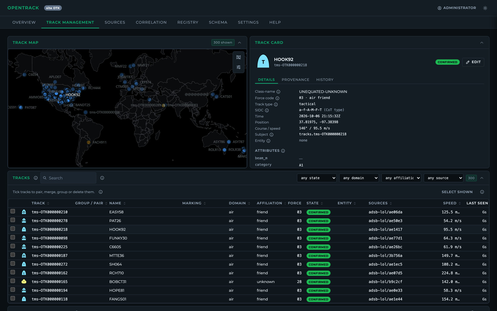

# OpenTrack

**An open, explainable track management server.** OpenTrack takes in any number of track and sensor
feeds (AIS, ADS-B, TAK/CoT, SAPIENT, STANAG 4607 GMTI, radar and lidar plots, ESM bearings and
more) and fuses them into one correlated picture, which it publishes to NATS JetStream and TAK. Every
merge, split and pairing records the evidence behind it, so an operator can see why it happened and
undo it.

[Website](https://kineticlogic-io.github.io/OpenTrack/) ·
[Administrator guide](docs/guides/admin.md) ·
[Operator guide](docs/guides/operator.md) ·
[Reference](docs/reference.md) ·
[Changelog](CHANGELOG.md)



## Features

- **Onboarding without code.** Pick a transport (TCP, UDP and multicast, HTTP polling, WebSocket,
  MQTT, gRPC, file) and a codec (JSON, XML, CoT, protobuf, SAPIENT, STANAG 4607). OpenTrack probes
  the feed, infers its schema and suggests a mapping. A live preview shows each pipeline stage.
- **Tracking and correlation.** GNN and MHT trackers turn anonymous plots into tracks. The
  correlator pairs tracks across sources and logs the evidence for each comparison. Lines of
  bearing, areas of uncertainty and ELINT are handled as well as points.
- **Track management.** Designate, pair, merge, split, group and delete tracks. Every decision
  goes in the log and can be undone. The registry holds known entities, and a MIL-STD-2525D symbol
  designer sets their symbols.
- **Several nodes, one picture.** Server sites and drone swarms sync with each other with no leader
  node, and keep one ID per object across a network split.
- **Extensible.** Codecs, trackers and pairing scorers can be added as plugins in Rust, Python or
  WASM ([plugins](docs/plugins.md)).
- **Built for accreditation.** FIPS 140-3 cryptography, ASD STIG controls, a hash-chained audit
  log, OpenTelemetry export and signed images ([security docs](docs/security/)).
- **Measured.** 16,000 live tracks at 1 Hz on one host. The benchmark scores every change against
  recorded and simulated scenarios ([algorithms](docs/algorithms.md)).

## Quick start

With Docker:

```sh
git clone https://github.com/kineticlogic-io/OpenTrack.git && cd OpenTrack
cat > .env <<'EOF'
OT_ADMIN_EMAIL=you@example.com
OT_ADMIN_PASSWORD=Choose-A-Long-Passw0rd!
OT_NATS_URL=nats://nats:4222
EOF
docker compose --profile dev-nats up --build
```

Open <http://localhost:8090> and sign in. To add a feed, choose **Sources → Add source**, or load one
of the [worked examples](docs/examples/):

```sh
curl -X POST -H 'content-type: application/json' \
     --data @docs/examples/adsb-lol.json localhost:8090/api/v1/sources
```

From source (Rust stable, Node 22, Redis, and NATS with JetStream):

```sh
cargo build --release
(cd ui && npm ci && npm run build)
./target/release/opentrack all        # API and UI on :8090, plus every other role
```

The [administrator guide](docs/guides/admin.md) covers production installs, TLS, SSO, multi-node
setups and upgrades.

## Demos

- **SAPIENT acoustic arrays:** `docker compose -f docs/examples/sapient/docker-compose.yml up -d`,
  then `scripts/demo-sapient-acoustic.sh`.
- **Benchmarks and replays:** recorded Autoferry lidar and radar data, GMTI, AIS and ADS-B with
  simulated radars. See [scripts/benchmark](scripts/benchmark/README.md).

## Project layout

| Path | What's in it |
|---|---|
| `crates/` | The Rust server: sources, correlation engine, store, sync, plugins, codecs |
| `ui/` | The web UI (React, MapLibre) |
| `sdk/` | Plugin SDKs for Rust and Python |
| `docs/` | Guides, reference, examples, security and accreditation documents, the website |
| `profiles/` | Tracker profiles for common sensors |
| `scripts/` | Benchmark, release and demo tooling |

## Status

OpenTrack is **alpha**. The API, the published message (`opentrack.track.v2`), the plugin interface
and the database schema may still change between releases. Back up `data/opentrack.db` before
upgrading. Migrations run on start.

## Contributing

Issues and pull requests are welcome. Run `scripts/check.sh` before you open a pull request (it runs
fmt, clippy, the tests and the UI build). Report security issues as described in
[SECURITY.md](SECURITY.md), not in public issues.

## Consulting and support

OpenTrack is built by [kineticlogic.io](https://github.com/kineticlogic-io). For integration work,
custom codecs and data links, deployment and accreditation support, or a consultation, email
**[parker@kineticlogic.io](mailto:parker@kineticlogic.io)**.

## License

[MIT](LICENSE). Third-party components keep their own licenses. See
[THIRD_PARTY_NOTICES.md](THIRD_PARTY_NOTICES.md).
