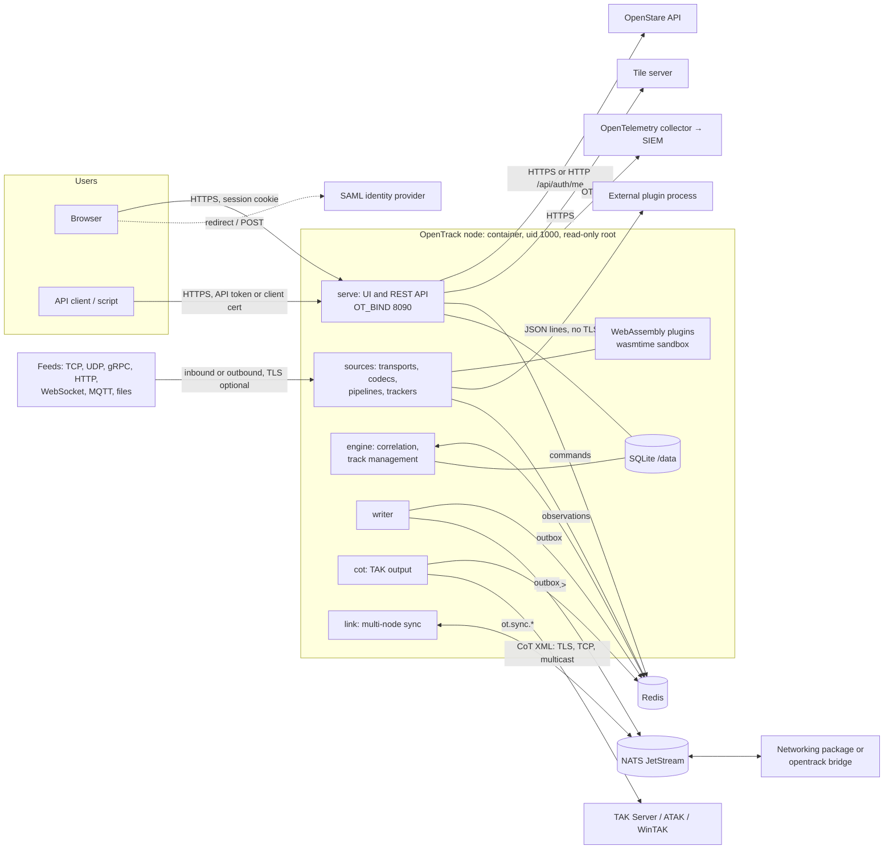

# Threat model

OpenTrack 0.4.3, by interface and trust boundary, using STRIDE (spoofing, tampering,
repudiation, information disclosure, denial of service, elevation of privilege). For each
interface: the threats that matter, what mitigates them today (with the code or document that
shows it), what is left, and the POA&M item that covers it ([`ato/poam.md`](ato/poam.md)).
The last section is the criticality analysis.

**Review rule.** The maintainer re-reviews this document for every minor release (0.5.0, 0.6.0,
…), and in the pull request of any change that adds an interface, a trust boundary, a way of
signing in or a dependency on the security-critical list below. The review is recorded in that
release's CHANGELOG entry.

## System and data flows

One binary, `opentrack`, runs the roles `serve`, `sources`, `engine`, `writer`, `cot` and `link`
(`all` runs them in one process). Two stores hold its state: SQLite on the `/data` volume (everything
people configure or decide, accounts, the audit record) and Redis (everything the feeds produce).
Published tracks leave over NATS JetStream and TAK. Nodes share a picture through NATS subjects a
networking package carries.

**Trust boundaries**, from least to most trusted:
1. The network in front of the control plane, and the feeds and TAK clients.
2. Signed-in users, by role: `viewer < track_manager < admin`.
3. The deployment's services: Redis, NATS, the collector, the identity provider, OpenStare, the
   networking package. OpenTrack authenticates to them and encrypts the link, but trusts what
   they say once connected.
4. Code OpenTrack runs: WebAssembly plugins (sandboxed), external plugins (not sandboxed, trusted
   as far as their host is).
5. The host: the container runtime, the `/data` volume, the environment (`OT_*` secrets).

## UI and REST API (control plane)

`crates/ot-server/src/control.rs`, `https.rs`, `auth/`. Sessions, API tokens, roles.

| | Threat | Mitigations | Residual risk | POA&M |
|---|---|---|---|---|
| S | Password guessing, credential stuffing | Lockout after 3 failures in 15 minutes until an admin unlocks (`auth/stig.rs`); per-address rate limit, a burst of 5 then one a second (`auth/mod.rs`); PBKDF2-HMAC-SHA256, 600,000 iterations; 15-character, four-class policy | No check against a compromised-password list | P-15 |
| S | Stolen session or token replayed | Server-side session record, idle timeout 15 minutes (admins 10), 24 h maximum, 3 per account, revocable (`auth/sessions.rs`); cookie `HttpOnly`, `SameSite=Strict`, `Secure` over TLS, ends with the browser; HSTS; API tokens signed with the session key (HS256), each with a stored record that expires and can be revoked, voided when the account is turned off or its password set | A token stolen from a script's host works until revoked or expired | |
| T | Cross-site request forgery | `SameSite=Strict` session cookie; API tokens are headers; `frame-ancestors 'none'` and `X-Frame-Options: DENY` | No separate CSRF token: relies on SameSite, which every supported browser honours | |
| T | Script injection into the UI | CSP: script from this origin only, no inline or evaluated script (`control.rs`, `CSP`); React escaping; no `dangerouslySetInnerHTML` ([coding-standards.md](coding-standards.md)) | Inline styles allowed (F-5) | P-25 |
| R | A user denies a change | Every change is a decision with its actor; the audit record is append-only and hash-chained (`ot-store/src/audit.rs`), exported as `audit.record` to the SIEM | Refused requests, reads of security objects, sign-ins by certificate, token and OpenStare, and the client address on decisions are not audited | P-01, P-02, P-03 |
| I | Data read beyond a user's role | Every `/api/v1` route has a role (`auth/policy.rs`, tested); unlisted changes need an admin; source secrets masked for non-admins (`ot_core::secrets`); server errors answer with a reference only (`ApiError`); status detail for admins only | Viewers see the whole picture: OpenTrack does not filter by clearance (AC-16, by design); outputs carry no classification markings | P-10 |
| D | Request floods, large bodies | Body limits (axum default; explicit ones for imports, plugins, sheets); sign-in rate limit | No general per-client rate limit on the API; a proxy or the platform provides it | |
| E | A user raises their own role | Roles only changed by admins; SAML gives at most `track_manager` unless **Allow admin**; SAML never takes a local account; `OT_AUTH=off` makes everyone admin but is excluded by the hardening checklist (F-4) | Administration shares the user listener | P-18 |

## SAML assertion consumer

`auth/saml.rs`, `third_party/samael`, libxmlsec1 and libxml2 through OpenSSL's FIPS provider.

| | Threat | Mitigations | Residual risk | POA&M |
|---|---|---|---|---|
| S | Forged or altered assertion | Signature checked against the pasted IdP metadata only (F-3); the OpenSSL FIPS provider must be active or SAML is refused (`openssl_fips()`) | An IdP signing with SHA-1 would verify; the hardening checklist requires RSA-SHA256 or stronger | |
| S | Replay, or a response to a request OpenTrack never made | Relay state HMAC-signed by OpenTrack, request id matched, each assertion used once, 5-minute window | | |
| T | XML attacks (XXE, entity expansion, signature wrapping) | Responses over 256 KB or with a DTD refused before parsing; libxml2 strict, no network, no recovery (#58); samael's verification of the signed element | libxml2 and xmlsec are C libraries from the Debian base, with open scan findings | P-22 |
| E | IdP grants admin, or takes over a local account | **Allow admin** off by default; a matching local account is refused (F-1); the IdP is authoritative for a `saml` account's role | An admin who turns **Allow admin** on trusts the IdP's role mapping | |
| R | Refused sign-ons unrecorded | Every refusal is audited with its reason | | |

## Client certificates and OpenStare sign-in

`auth/mod.rs`, `auth/openstare.rs`, `ot-source/src/tls.rs`.

| | Threat | Mitigations | Residual risk | POA&M |
|---|---|---|---|---|
| S | A revoked or foreign certificate signs in | Path validation to `OT_TLS_CLIENT_CA`; CRLs (`OT_TLS_CLIENT_CRL`) fail closed on unknown status or a stale list, reloaded on change; only mapped CNs sign in, to active accounts | No OCSP; certificate sign-ins are not audited | P-26, P-02 |
| S | OpenStare's answer is spoofed | Off by default; OpenTrack asks OpenStare's `/api/auth/me` itself; roles only by the mapping (unlisted roles refused) | Default API URL is plain HTTP on loopback; over a network it must be HTTPS. A compromised OpenStare signs users in here up to the mapped role, for up to 30 s after a revocation | P-02 |

## Source transports

`crates/ot-source/src/transport.rs`, `tls.rs`, `grpc.rs`, `frame.rs`, codecs and pipelines.

| | Threat | Mitigations | Residual risk | POA&M |
|---|---|---|---|---|
| S | An unauthorised device feeds false tracks to a listener | A listener must authenticate its senders: `tcp_server` by TLS with a client CA (and CRLs), `grpc_server` by that or a bearer token (and a method allow-list). Otherwise it is refused, on save and at start, unless the source carries `"unauthenticated": "accepted"`, which the decision log records | UDP and multicast cannot authenticate; each such source, and any other accepted listener, is an exception the authorising official accepts | |
| S | A client connects to an impostor feed | TLS with the system roots or a private CA, and an optional server name; client certificates | `insecure_skip_verify` exists (F-4, excluded by the hardening checklist) | |
| T | Malformed or hostile input | Typed decoding; frame limit (4 MiB default); gRPC `max_message_kib`; malformed gRPC messages refused with INVALID_ARGUMENT; no `unsafe` in OpenTrack's code; pipeline reject stage | A feed that authenticates can still lie: correlation weighs it, a track manager can drop it | |
| I | Feed credentials disclosed | Secrets masked for non-admins; `${env:NAME}` keeps them out of the database; source changes audited masked (#62) | Inline secrets are in the database and its backups | |
| I | File transport reads arbitrary files | Files only under the data directory, checked when saved, probed, imported and started; probes audited (#63) | | |
| D | Flooding a listener | `grpc_server` `max_connections`; per-source Redis stream bounded by `OT_OBS_WINDOW_SECS`; one source cannot stop another | UDP floods are the network's to stop | |
| E | An admin-configured URL used to reach internal services (SSRF) | Only admins create sources or probe (`/probe` is an admin route) | An admin can point a source anywhere the host can reach: that is the feature | |

## Plugins

`crates/ot-plugin/` (`wasm.rs`, `grants.rs`, `external.rs`), [docs/plugins.md](../plugins.md).

| | Threat | Mitigations | Residual risk | POA&M |
|---|---|---|---|---|
| T | A malicious or buggy WebAssembly plugin reads files, calls out or exhausts the host | wasmtime sandbox; WASI grants: no directories, network or environment unless granted; memory ceiling (256 MB default); call timeout by epoch interruption (5 s default), the instance discarded after; one instance per stream | wasmtime is a large dependency; a sandbox escape there would be a host compromise | |
| T | A replaced plugin file | Only admins add or replace; each change is in the decision log with the component's SHA-256; loaded before it is stored | | |
| S, I, T | An external plugin impersonated or its traffic read | Only admins add one; call timeout; on every connection OpenTrack and the plugin prove they hold a shared secret (HMAC-SHA256 challenge and response each way, role-labelled so a reflected challenge fails); one that fails is refused, logged and audited; without a secret only a Unix socket under the data directory is reached | JSON lines with no TLS: after the handshake traffic can be read or changed on the way; the secret is stored in the database (OpenTrack must answer with it); the process is not sandboxed. Keep external plugins on the same host (loopback or a Unix socket) | P-28 |

## Redis

| | Threat | Mitigations | Residual risk | POA&M |
|---|---|---|---|---|
| S, T | Someone with Redis access injects observations or engine commands (`tms:cmd`), bypassing the API's role checks | `rediss://` with a CA and mutual TLS; a password; keys under one namespace | Anyone who can write to OpenTrack's namespace can change the picture: Redis is inside OpenTrack's trust boundary. Give it its own ACL user and network | |
| I | The live picture read from Redis | TLS; Redis ACLs (the site's) | Redis data at rest is unencrypted unless the platform encrypts it | |
| D | Redis down or full | Roles reconnect; the observation window bounds each stream; `/api/v1/status` reports it | Redis sizing is the site's | |

## NATS output

`crates/ot-nats/`, `writer.rs`, [docs/nats-output.md](../nats-output.md).

| | Threat | Mitigations | Residual risk | POA&M |
|---|---|---|---|---|
| S | Someone publishes false tracks on `tracks.>` | NATS authorisation (the site's); OpenTrack authenticates with `.creds` (signed with AWS-LC), a token, or mutual TLS | Consumers trust the subject; NATS permissions must allow only OpenTrack to publish there | |
| I | The picture read in transit | `tls://`, `OT_NATS_CA`, mutual TLS | | |
| I | Published tracks carry no classification marking | Labels travel in the message's security fields | Outputs are unmarked | P-10 |

## Multi-node sync

`link.rs`, `bridge.rs`, `crates/ot-sync/`, [docs/multi-node.md](../multi-node.md), [docs/sync-icd.md](../sync-icd.md).

| | Threat | Mitigations | Residual risk | POA&M |
|---|---|---|---|---|
| S | A rogue node sends reports or decisions (merges, deletes) | Messages from site codes not in **Trusted nodes** are dropped and counted; the networking package must prove the sender (keys, certificates, radio crypto) | OpenTrack trusts the site code the package gives it; anyone who can publish on `<prefix>.in.*` on the local NATS can claim a trusted site. Restrict those subjects to the package | |
| T | Replayed or reordered decisions | HLC ordering, global decision ids (duplicates harmless), anti-entropy repair | | |
| I | The picture read on the link | The package's encryption | `opentrack bridge` takes only NATS URLs: no CA, client certificate or `.creds` options | |
| E | Users of an unattended node (a drone) change the shared picture | **Receive only** accepts no track management from the node's own users | | |

## TAK output

`crates/ot-server/src/cot/`, admin guide [TAK output](../guides/admin.md#tak-output).

| | Threat | Mitigations | Residual risk | POA&M |
|---|---|---|---|---|
| I | The picture read by anyone on the path, or by anyone who connects to a listening output | TLS to TAK Server with a client certificate; listening outputs with TLS, a client CA and CRLs; the panel marks each output TLS or plaintext and the role warns when a plaintext one starts | Plain TCP and multicast (always plaintext) are available for protected networks; the hardening checklist requires a documented risk acceptance | |
| I | Events carry no classification marking | | CoT events are unmarked | P-10 |
| S | A client impersonates the server | Clients verify OpenTrack's certificate | | |
| D | A slow client holds up the others | Per-client queue of 8,192 events; a client that falls behind is dropped and counted | | |

## OpenTelemetry export

`telemetry.rs`, admin guide [OpenTelemetry](../guides/admin.md#opentelemetry).

| | Threat | Mitigations | Residual risk | POA&M |
|---|---|---|---|---|
| I | Logs and audit records read in transit | `https://` endpoints on the FIPS module, a private CA, mutual TLS, headers | An `http://` endpoint is plaintext; the hardening checklist requires `https://` | |
| I | Secrets in logs | Secrets are never logged ([coding-standards.md](coding-standards.md)); server-error detail goes to the log, not the caller | | |
| R, D | The record lost when the collector is down | The audit table keeps every record; the gap is refilled from `GET /api/v1/audit`; the outage is shown in status | Alerting on silence is the SIEM's | |

## SQLite and the data volume

`crates/ot-store/`, admin guide [Data directory](../guides/admin.md#data-directory), [Configuration export](../guides/admin.md#configuration-export).

| | Threat | Mitigations | Residual risk | POA&M |
|---|---|---|---|---|
| I | Theft of the volume or a backup: password hashes, inline feed secrets, plugin files, `session.key` | `session.key` and `initial-admin.txt` mode 0600; only `/data` writable; tokens themselves never stored | Encryption at rest is the platform's (SC-28) | |
| T | Audit rows edited or deleted | Triggers refuse UPDATE and DELETE; SHA-256 hash chain; `GET /api/v1/audit/verify`; chain head logged hourly, so a cut tail shows in the SIEM | Someone with the file can rebuild the chain; the exported copy is the check | |
| I | Configuration export leaks secrets | Admins only; audited (`export_config`); `Cache-Control: no-store`; CLI file mode 0600 | The file must be kept like the database | |
| E | Forged sessions from a stolen `session.key` | Keep it (or `OT_SESSION_SECRET`) in the secret store; changing it voids every session and token | | |

## Container, image and supply chain

`Dockerfile`, `docker-compose.yml`, [supply-chain.md](supply-chain.md), [scm-plan.md](scm-plan.md).

| | Threat | Mitigations | Residual risk | POA&M |
|---|---|---|---|---|
| T | A tampered image | Release images signed with the project's cosign key and verified in the release process; SLSA provenance and SBOM attestations; base images by digest; Go and OpenSSL source checked by SHA-256 | Signing uses cosign's own (non-FIPS) cryptography and a file key | P-17 |
| T | A malicious or vulnerable dependency | Lockfiles and `--locked`; cargo-deny (RustSec, licences, crates.io only, banned crates); `npm audit`; forks reviewed with notes; CI actions pinned by commit | Advisories are checked on each push and release, not on a schedule; while GitHub Actions is unavailable the checks run on the test server by hand | P-23 |
| T | Unreviewed changes on `main` | Branch protection: pull requests, one approval, required checks, no force-push | Admins may bypass; with one maintainer, merges currently use the bypass ([scm-plan.md](scm-plan.md#repository-and-branches)) | |
| E | Container escape or privilege use | Non-root (uid 1000), read-only root, every capability dropped, `no-new-privileges` | The sample compose uses host networking, a bind mount and no resource limits | P-21 |
| — | Known vulnerabilities in the base image | Each release image scanned (Trivy, Grype) | Debian 12 packages with unfixed Critical and High findings | P-22 |

## Criticality analysis

The components whose failure or compromise would break a security property, and why. They get
the closest review: a change to any of them names the component in its pull request, comes with
tests of the property, and is called out in the CHANGELOG. A dependency update that touches one
(for example a new `aws-lc-fips-sys`, `samael`, `rustls` or `wasmtime`) is treated the same way.

| Component | Where | Why it is critical | Level |
|---|---|---|---|
| Authentication and sessions | `crates/ot-server/src/auth/` (`mod.rs`, `api.rs`, `sessions.rs`, `password.rs`, `stig.rs`, `consent.rs`, `maintenance.rs`) | Decides who is signed in; enforces the STIG account policy, lockout, session limits, inactivity, consent | High |
| Authorisation | `auth/policy.rs`, `auth::layer` | The only place a route's role is decided; a wrong line exposes or opens a route | High |
| FIPS cryptographic boundary | `crates/ot-server/src/fips.rs`; `aws-lc-rs` / `aws-lc-fips-sys`; rustls FIPS provider; the OpenSSL 3.0.9 FIPS provider and `docker/openssl-fips.cnf` in the image | All cryptography; the validated-module claim (SC-13, IA-7) rests on it ([fips.md](fips.md)) | High |
| SAML | `auth/saml.rs`; `third_party/samael`; libxmlsec1, libxml2 | Parses untrusted XML and decides sign-in from a signature | High |
| TLS configuration | `crates/ot-server/src/https.rs`; `crates/ot-source/src/tls.rs` (client and server TLS, CRLs); TLS in the NATS, Redis, MQTT, TAK and OTLP clients | Confidentiality and peer authentication of every link; revocation checking | High |
| Audit | `crates/ot-store/src/audit.rs` (append-only table, hash chain, verify); `telemetry.rs` (export) | Accountability; the evidence of what happened (AU family) | High |
| Plugin sandbox | `crates/ot-plugin/src/wasm.rs`, `grants.rs`; `wasmtime` | Runs third-party code in the server process | High |
| Secrets masking | `crates/ot-core/src/secrets.rs` (re-exported as `ot_source::secrets`); `crates/ot-store/src/sources.rs` | Keeps feed credentials from non-admins and from the decision log and audit record | High |
| Configuration export and import | `crates/ot-server/src/config_backup.rs`, `crates/ot-store/src/backup.rs` | Reads and writes every secret and account at once | High |
| Forked crates | `third_party/samael` (SAML, FIPS check, quick-xml fix), `third_party/rumqttc` (no `ring`) | Carry security fixes that upstream does not; must be kept current by hand (their `OPENTRACK.md`) | High |
| Input handling | `crates/ot-source/src/frame.rs`, `transport.rs`, `grpc.rs`, codecs; `ot-codec-stanag4607`, `ot-sapient` | Parse untrusted network data | Medium |
| Security headers and errors | `crates/ot-server/src/control.rs` (`CSP`, `security_headers`, `ApiError`) | Browser protections; no internal detail to callers | Medium |
| Multi-node trust | `crates/ot-server/src/link.rs`, `crates/ot-sync/` | Applies other nodes' decisions to this node's picture | Medium |
| Release signing | `.github/workflows/release.yml`, `cosign.pub`, the signing key | Lets a site prove the image is the project's | Medium |

The mission functions (correlation in the engine, the writer's publishing) matter for the
picture's integrity rather than for security; their correctness is covered by tests and the
benchmark, not by this list.
